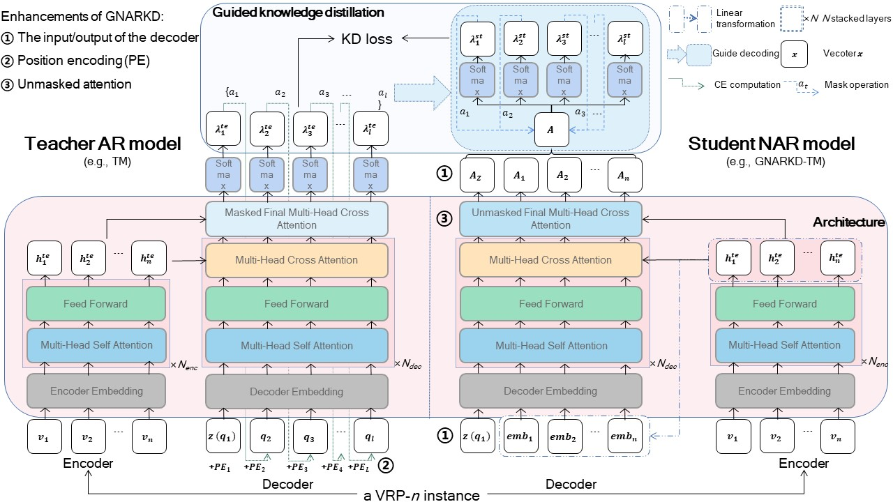
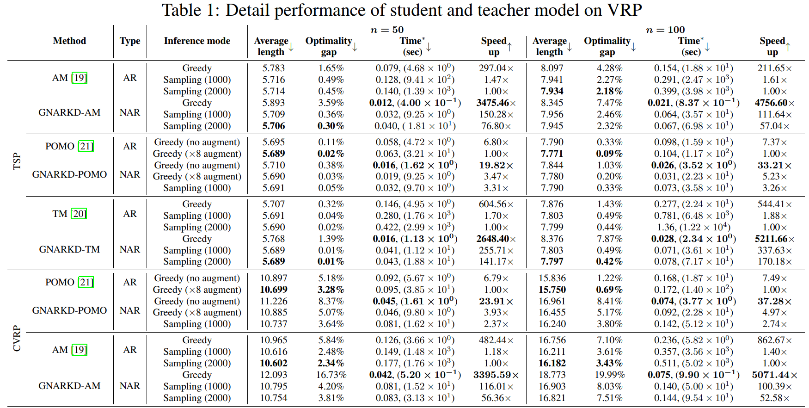

<h1 align="center"> Distilling Autoregressive Models to Obtain High-Performance Non-Autoregressive Solvers for Vehicle Routing Problems with Faster Inference Speed </h1>


The PyTorch Implementation of *AAAI 2024 -- "Distilling Autoregressive Models to Obtain High-Performance Non-Autoregressive Solvers for Vehicle Routing Problems with Faster Inference Speed"*[pdf](https://arxiv.org/abs/2312.12469).

<p align="center"></p>

This paper introduce a novel and generic method for solving VRPs named GNARKD to transform AR models into NAR ones to improve the inference speed while preserving essential knowledge.


### How to Run


```shell
# 1. Training (for each teacher, e.g. POMO for TSP)
python -u GNARKD-POMO\TSP\Training.py

# Note that due to file size limitations, we removed the teacher's pre-training parameters, which you can download from the github link mentioned in the corresponding paper for successful training.


# 2. Testing (e.g., GNARKD-POMO for TSP)
python -u GNARKD-POMO\TSP\Test_file.py
```

The detail performance is as follows.
<p align="center"></p>


### Acknowledgments

* We would like to thank the anonymous reviewers and (S)ACs of AAAI 2024 for their constructive comments and dedicated service to the community. The reviews are available [here](https://github.com/xybFight/GNARKD/blob/master/AAAI24_Comments.pdf)
* We also would like to thank the following repositories, which are baselines of our code:

  * https://github.com/wouterkool/attention-learn-to-route

  * https://github.com/yd-kwon/POMO

  * https://github.com/xbresson/TSP_Transformer


### Citation

If you find our paper and code useful, please cite our paper:

```tex
@InProceedings{GNARKD2024, 
              author={Xiao, Yubin and Wang, Di and Li, Boyang and Wang, Mingzhao and Wu, Xuan and Zhou, Changliang and Zhou, You}, 
              title = {Distilling Autoregressive Models to Obtain High-Performance Non-autoregressive Solvers for Vehicle Routing Problems with Faster Inference Speed}, 
              volume={38}, 
              number={18}, 
              booktitle={Proceedings of the AAAI Conference on Artificial Intelligence}, 
              year={2024}, 
              pages={20274-20283},
              DOI={10.1609/aaai.v38i18.30008}, }
```
We purchased an additional page, but it still wasn't enough to fully show our work. Please refer to the [Arxiv version](https://arxiv.org/abs/2312.12469) for all content. 


